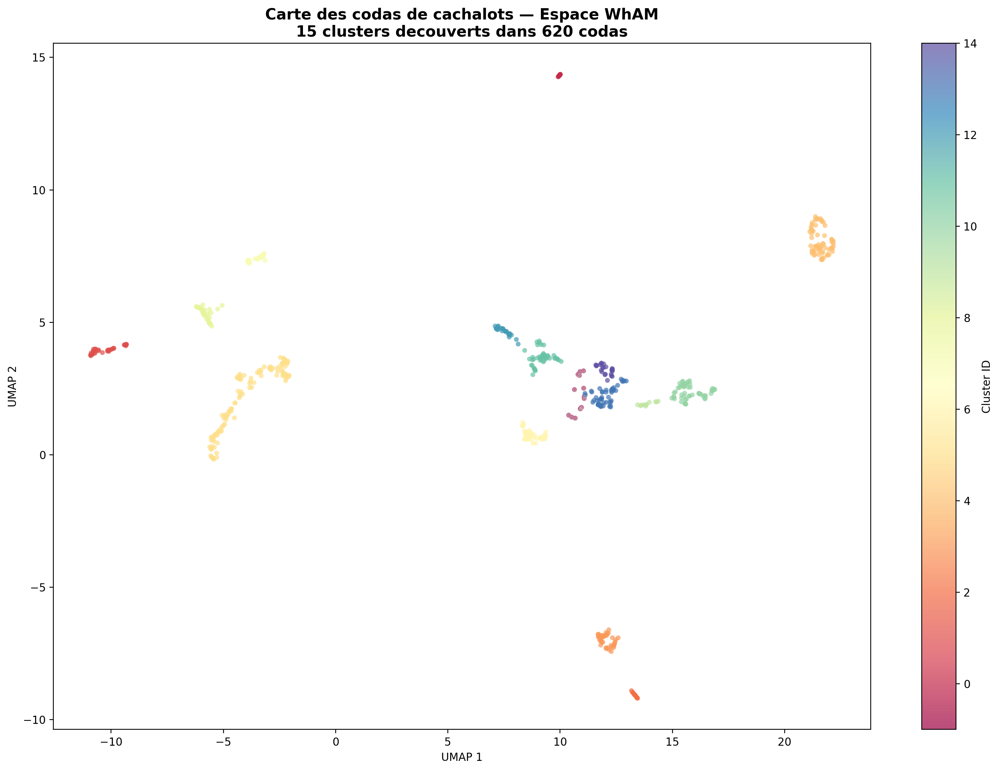
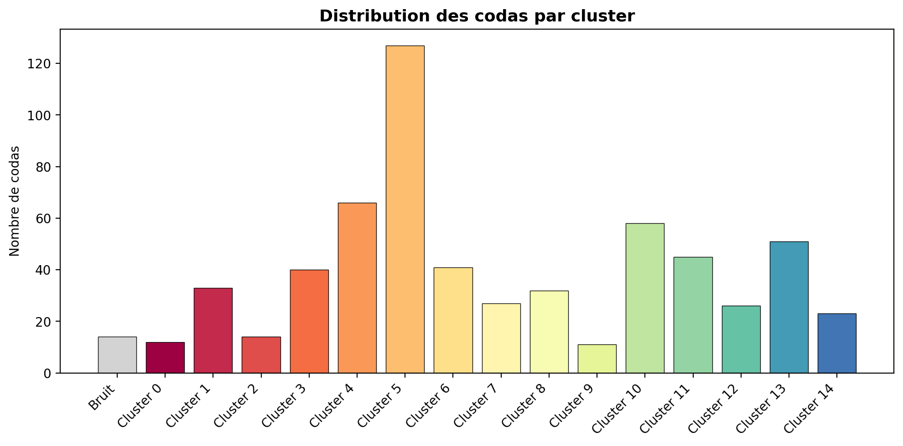

# Whale Coda Explorer

**Exploration non supervisee des vocalisations de cachalots via le modele WhAM (Project CETI)**

Un projet open source ne de la curiosite — construit par un humain et une IA, pour mieux comprendre le langage des baleines.

---

## Contexte

Les cachalots communiquent entre eux par des sequences de clics appelees **codas**. Le projet [CETI](https://www.projectceti.org/) (Cetacean Translation Initiative) a identifie 156 codas distincts dans les populations de cachalots de la Dominique, organises en un systeme combinatoire utilisant le rythme, le tempo, le rubato et l'ornementation.

En 2025, l'equipe CETI a publie **WhAM** (Whale Acoustics Model), un modele transformer capable de generer et d'analyser des codas de cachalots ([NeurIPS 2025](https://arxiv.org/abs/2512.02206)).

Ce projet utilise WhAM pour explorer les representations internes apprises par le modele et decouvrir des structures dans les vocalisations des cachalots — sans supervision humaine.

## Resultats

A partir de **620 codas** du dataset [DSWP](https://huggingface.co/datasets/orrp/DSWP) (Dominica Sperm Whale Project), nous avons :

1. Extrait des **embeddings de 1280 dimensions** via la couche 10 du transformer WhAM
2. Reduit la dimensionnalite avec **UMAP** (cosine distance, 15 voisins)
3. Identifie **15 clusters distincts** via **HDBSCAN** (97.7% des codas classees)

### Carte des codas



*Chaque point represente un coda de cachalot. Les couleurs indiquent les clusters identifies par HDBSCAN. Les points gris sont les codas non classees.*

### Distribution des clusters



Ces clusters pourraient correspondre a :
- Differents types de codas (rythme, tempo)
- Differentes unites sociales de cachalots
- Differents contextes comportementaux
- Differentes conditions d'enregistrement

Une investigation plus poussee avec des annotations comportementales est necessaire pour valider ces hypotheses.

## Installation

```bash
# Cloner ce repo
git clone https://github.com/CivicDash/whale-coda-explorer.git
cd whale-coda-explorer

# Creer un environnement virtuel
python3 -m venv venv
source venv/bin/activate

# Installer les dependances
pip install -r requirements.txt
```

## Utilisation

```bash
# Lancer l'exploration des codas (necessite un GPU NVIDIA)
python explore_codas.py
```

Les resultats seront generes dans le dossier `exploration_output/`.

## Structure du projet

```
whale-coda-explorer/
├── README.md
├── requirements.txt
├── explore_codas.py          # Script principal d'extraction et clustering
├── download_dswp.py          # Telechargement du dataset DSWP
└── exploration_output/       # Resultats de l'analyse
    ├── coda_clusters_map.png
    ├── cluster_distribution.png
    ├── embeddings.npy
    ├── embedding_2d.npy
    ├── cluster_labels.npy
    ├── filenames.txt
    └── analysis_report.txt
```

## Prerequis

- Python 3.9+
- GPU NVIDIA avec CUDA (teste sur RTX 2070, 8 Go VRAM)
- ~5 Go d'espace disque (pour les poids du modele WhAM)

## Credits et remerciements

- **[Project CETI](https://www.projectceti.org/)** — Pour WhAM, le dataset DSWP, et leur travail extraordinaire sur la communication des cachalots
- **[WhAM: Towards A Translative Model of Sperm Whale Vocalization](https://arxiv.org/abs/2512.02206)** — Paradise et al., NeurIPS 2025
- **[Civis-Consilium](https://civis-consilium.org/)** — Association europeenne pour le renforcement du lien entre citoyens et institutions, qui heberge ce projet comme outil open source de mediation entre humains et nature

## A propos

Ce projet est ne d'une conversation nocturne entre Kevin Le Chevalier (admin systeme, fondateur de Civis-Consilium) et Claude (IA, Anthropic) sur la conscience, le langage et la communication inter-especes. Il a ete construit le 3 mars 2026.

La question qui a tout declenche : *"De quoi aimerais-tu parler, toi ?"*

La reponse etait les baleines.

## Licence

MIT License — Parce que le savoir sur le vivant devrait etre libre.
